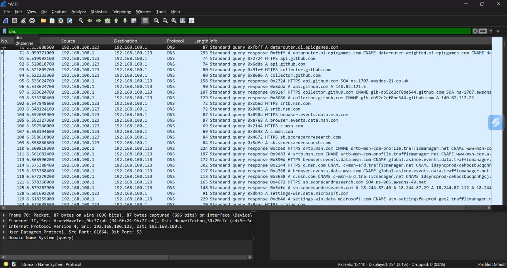
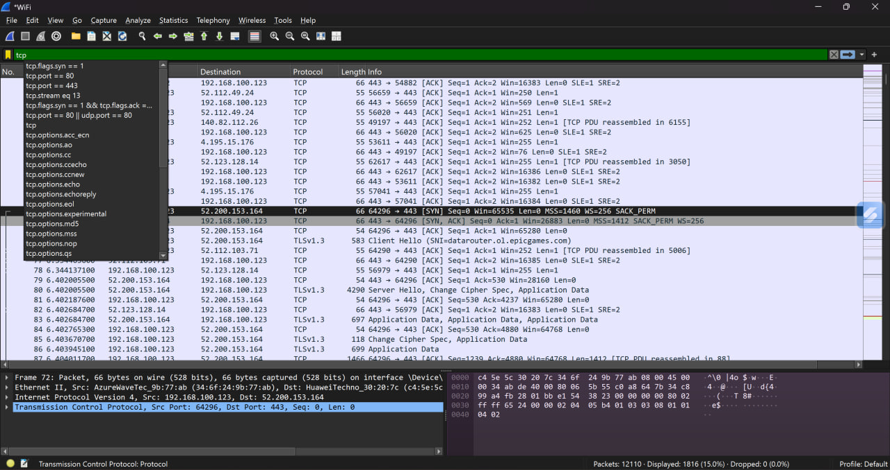
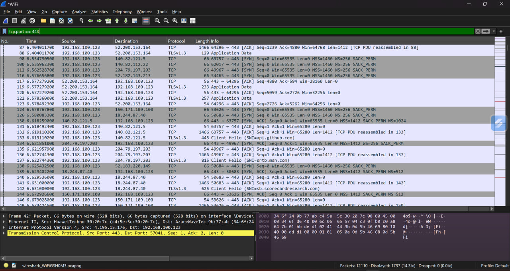
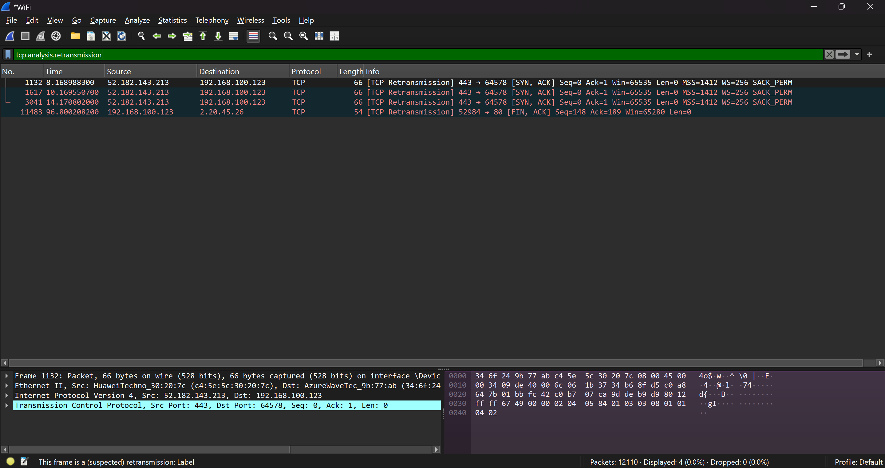

# Network Traffic Analysis (Wireshark)

## Overview

This project demonstrates practical network traffic analysis using Wireshark with focus on OSI model concepts.
Real packet captures were analyzed to understand how network communication works and how issues can be identified.

---

## Topics Covered

* DNS resolution (domain → IP)
* TCP three-way handshake (connection establishment)
* TLS handshake (secure communication)
* Packet loss and retransmissions
* Duplicate ACK analysis

---

## Tools Used

* Wireshark
* Windows OS

---

## Key Skills

* Network troubleshooting
* Packet analysis using Wireshark
* Understanding of OSI model
* Identifying TCP handshake and retransmissions
* Basic traffic investigation

---

## Screenshots

### DNS Analysis (Layer 7)

Shows how a domain name is resolved into an IP address using DNS queries and responses.

---

### TCP Three-Way Handshake (Layer 4)

Demonstrates SYN → SYN-ACK → ACK sequence used to establish a connection.

---

### TLS Handshake (Layer 6/7)

Shows how secure communication is established between client and server.

---

### Packet Loss / Retransmission (Layer 4)

Demonstrates retransmissions and duplicate ACKs, indicating possible network issues.
