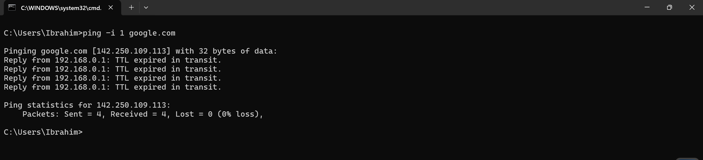
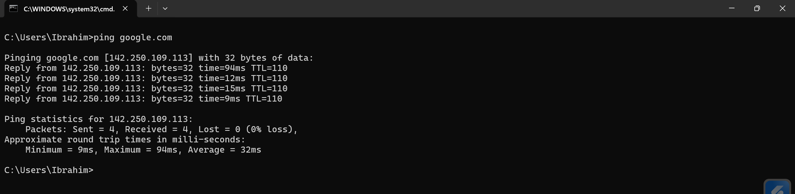
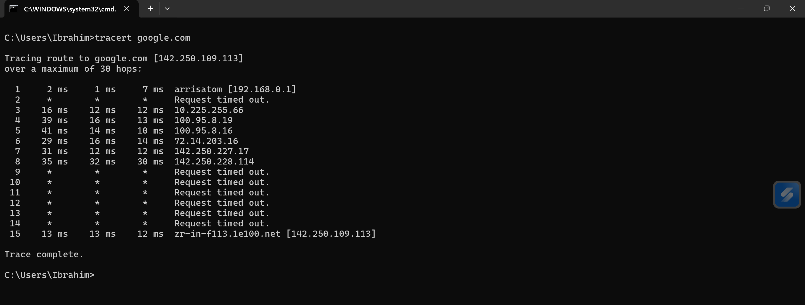
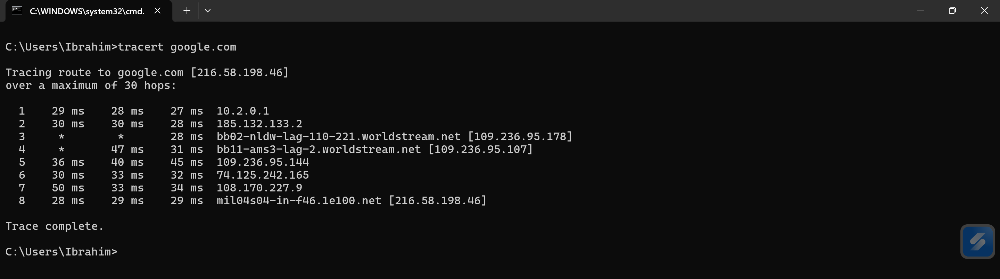

# Network Behavior Analysis

## Overview
This project demonstrates real-world network behavior using basic networking tools.

The goal of this lab is to understand how data moves across networks and how different technologies affect connectivity, performance, and routing.

---

## Tools Used

- Windows CMD
- ping
- tracert
- nslookup
- VPN (WireGuard)

---

## TTL (Time To Live)

### Command
ping -i 1 google.com

### Observation
Packets returned "TTL expired in transit".

### Explanation
Each router decreases the TTL value by 1.  
When TTL reaches 0, the packet is dropped.

This prevents infinite loops in the network.

### Default TTL Values
- Windows: 128  
- Linux/macOS: 64  

### Screenshots

  

---

## Traceroute

### Command
tracert google.com

### Observation
- Multiple hops were detected  
- Some hops returned "Request timed out"  

### Explanation
Each hop represents a router in the path from source to destination.

Timeouts may occur due to:
- Firewalls blocking ICMP
- Routers not responding to traceroute

### Screenshot

---

## VPN (Virtual Private Network)

### Steps
1. Run traceroute without VPN  
2. Enable VPN  
3. Run traceroute again  

### Observation
- Network path changed  
- Different IP addresses appeared  

### Explanation
VPN encrypts traffic and routes it through a remote server instead of a direct path.

### Key Insight
The first hop changed from the local network to a VPN gateway, confirming traffic is tunneled.

### Screenshots

#### Before VPN

#### After VPN

---

## QoS (Quality of Service)

### Observation
Video streaming remained stable during file download.

### Explanation
QoS prioritizes critical traffic such as video and voice over less important data.

---

## Skills Demonstrated

- Network troubleshooting  
- Understanding of routing and packet flow  
- VPN behavior analysis  
- TTL and loop prevention concepts  
- Real-world diagnostics using CLI tools  

---

## Conclusion

This lab demonstrates practical understanding of how networks behave under different conditions.

It shows the ability to analyze routing paths, detect network limitations, and understand how technologies like VPN and TTL affect traffic.
